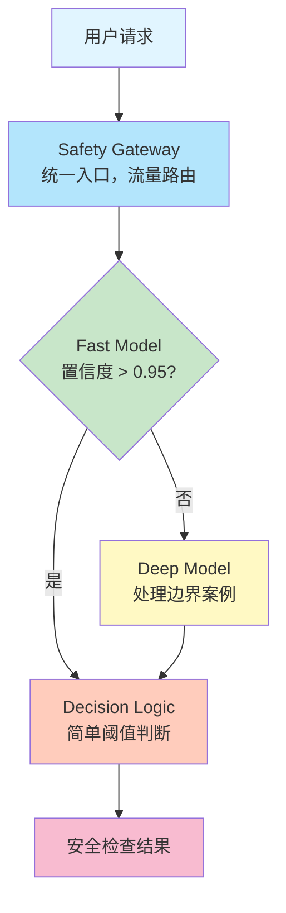
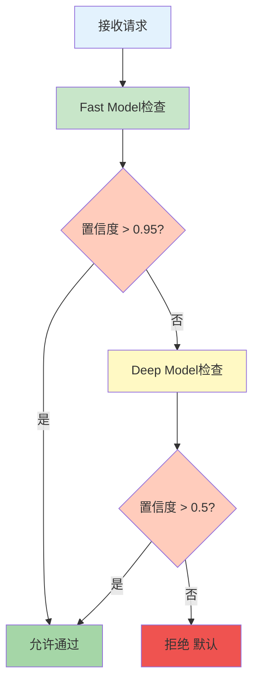
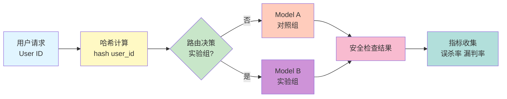
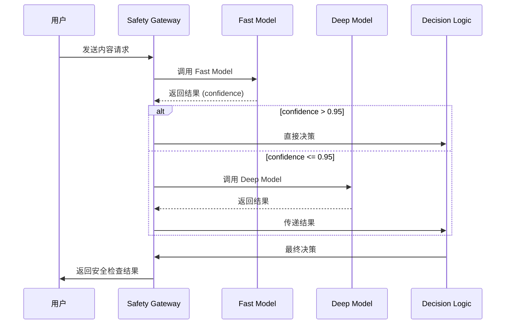
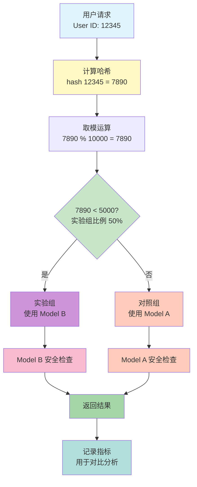
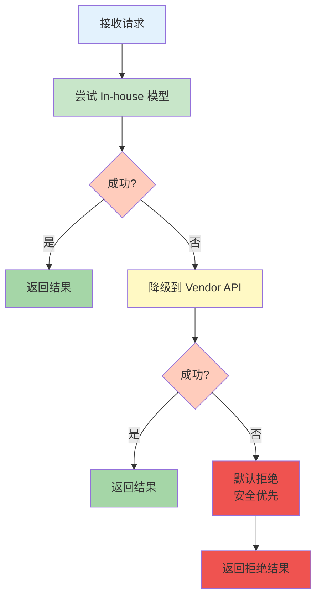
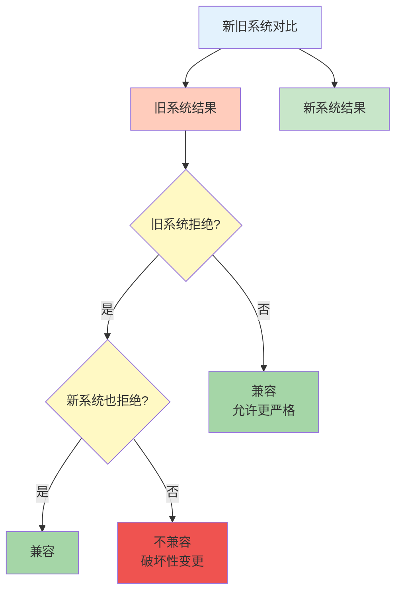
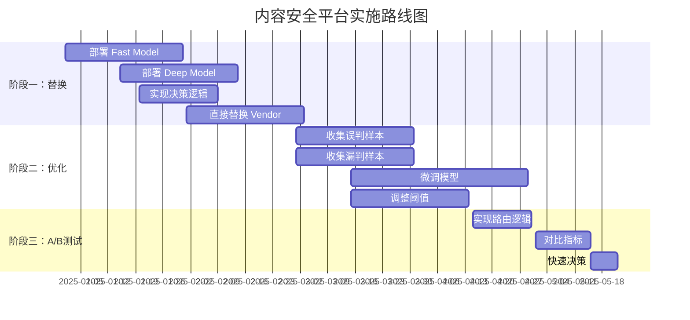

# Mermaid 图表：内容安全平台架构设计

本文档包含系统架构设计中的所有 Mermaid 图表代码，可以直接在支持 Mermaid 的 Markdown 编辑器或在线工具中使用。

## 1. 系统架构图

## 2. 数据流程图

## 3. A/B 测试流程图

## 4. 系统组件交互图

## 5. A/B 测试路由详细流程

## 6. 错误处理和降级策略

## 7. 向后兼容性检查流程

## 8. 实施路线图时间线

## 使用说明

1. **在 Markdown 中使用**：如果您的 Markdown 编辑器支持 Mermaid（如 Typora、Obsidian、GitHub），可以直接复制上述代码块。

2. **在线工具**：
   - [Mermaid Live Editor](https://mermaid.live/)
   - [Mermaid Chart](https://www.mermaidchart.com/)

3. **转换为图片**：
   - 使用 Mermaid CLI: `mmdc -i diagram.mmd -o diagram.png`
   - 使用在线工具导出为 PNG/SVG

4. **在 LaTeX 中使用**：
   - 使用 `mermaid` 包（需要 LuaLaTeX）
   - 或先转换为图片，然后用 `\includegraphics` 插入

